## Architecture
The actual and primary service request to be implemented is from the client to the Sigma API.
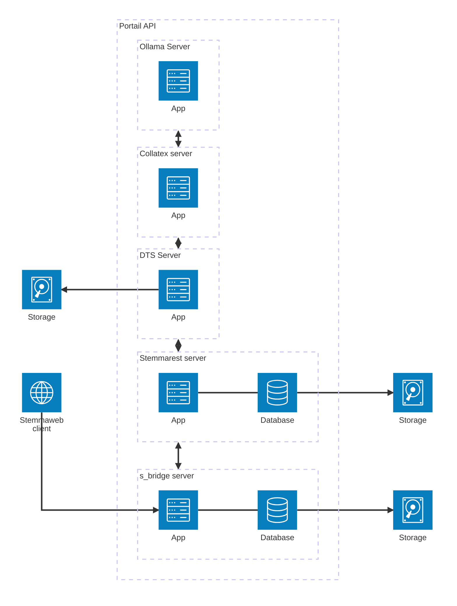

## User Stories
- As a user, I want to create a new Tradition from a DTS collection URL so that I can analyze and compare different versions of a text.
- [Optional] As a user, I want to add a new section to an existing Tradition from a DTS collection URL so that I can expand the analysis of the text.
- As a user, I want to check the status of my requests so that I can monitor the progress of my Tradition creation or section addition.
- As a user, I want to cancel a running request so that I can stop the process if needed.

## Endpoints
#### Tradition endpoints
- /api/v1/tradition [GET] : list Traditions
- /api/v1/tradition [POST] : create a new Tradition from a DTS collection URL
- /api/v1/tradition/{id}/section [POST] : add a new section to an existing Tradition from a DTS collection URL
- /api/v1/tradition/{id} [GET] : get Tradition info [opt]
#### Request endpoints
- /api/v1/request [POST] : create a new create tradition Request
- /api/v1/request/{id} [GET] : get request status and results
- /api/v1/request/{id}/cancel [POST] : cancel a running request

## Definitions

#### variables :
- version = {id: txt, content: txt}
- tokenized_version = {id: txt, content: txt, tokens: list[Token]}
- Token = {t: txt, n : txt<lem+pos>}
- CiteStructure = short version of a DTS CiteStructure, ca be used to describe xml file navigation stored in a local storage
- **σ = list[Section<list[Version]>], a set of text version** = Tradition
- Tσ = list[Section<list[TokenizedVersion]>], a set of tokenized text version
- root = root element of a document = TokenizedTradition
- n = list[CiteStructure] = navigation
- section = n[x]
- docRef = main document in collection, serve as a reference

## Interaction Diagrams
#### General entities interaction (overview)
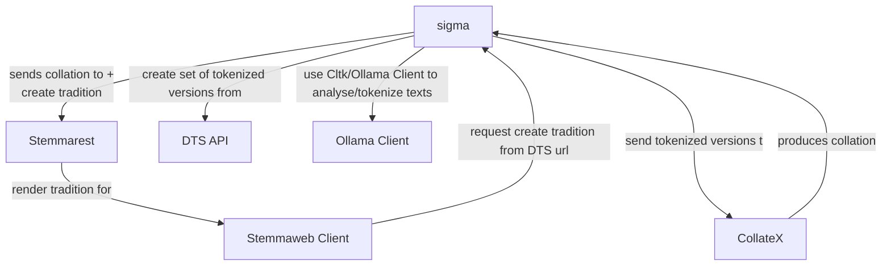

#### API entities interaction
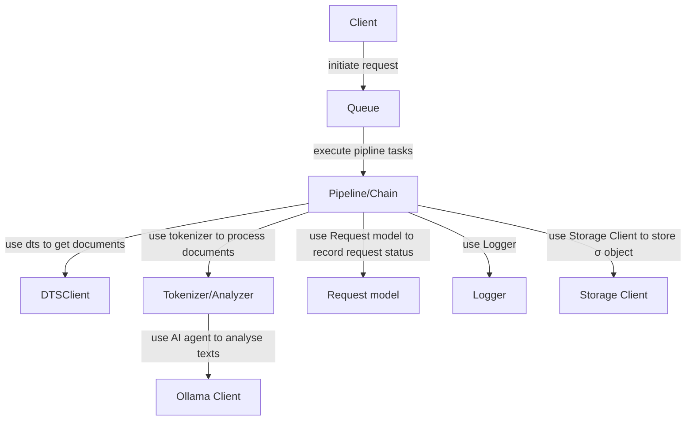

#### DTSClient entities interaction
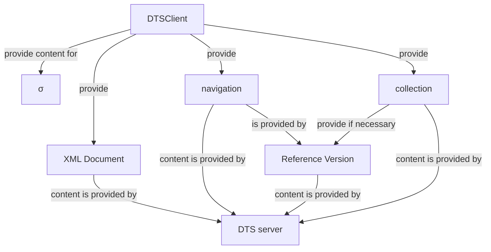

### Flows
#### Flow of a Request model when creating a Tradition
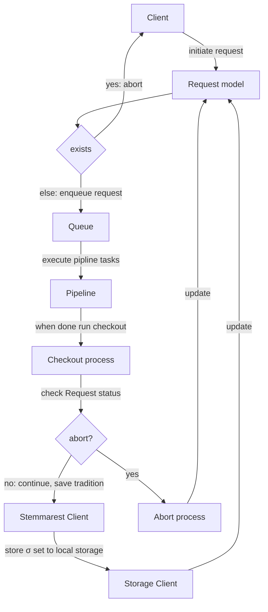

## Sequences
### Create Tradition from a DTS Collection (overview)

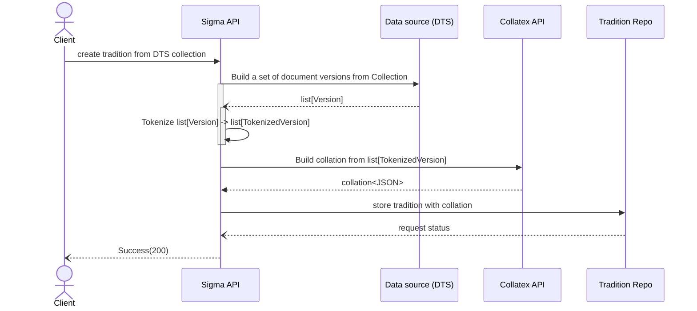

### Create Tradition from a DTS Collection (detailed)

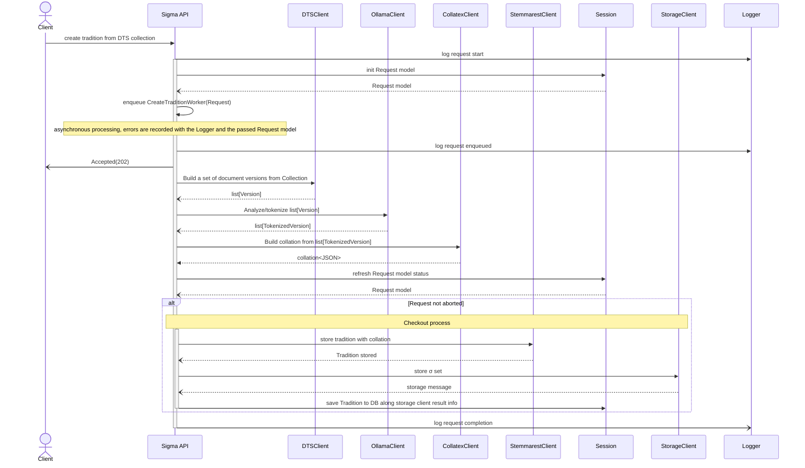

### update Tradition with a new Section from a DTS Collection
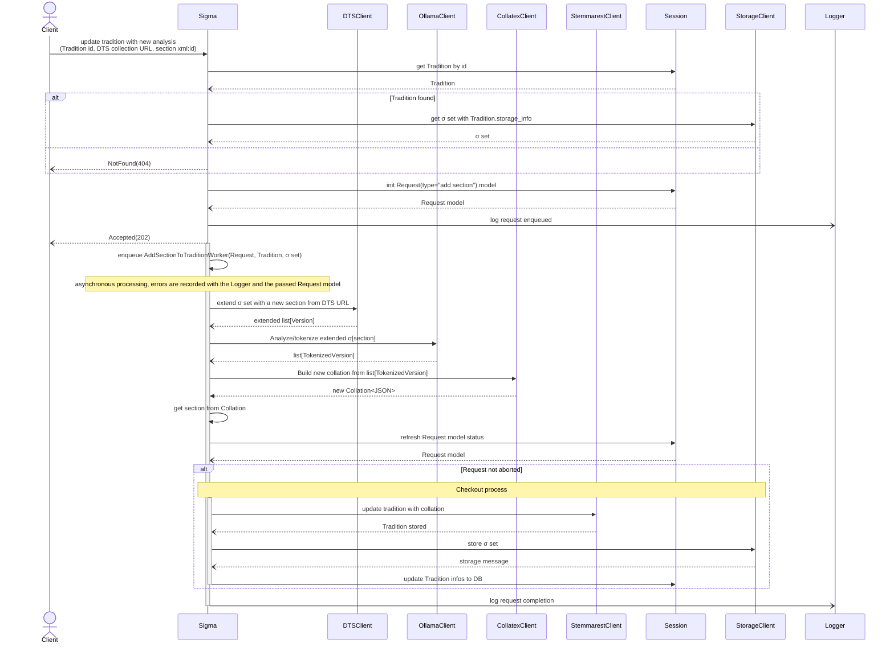

note: there is no way to update a section with a new witness graph right now in Stemmarest API. Todo: add into the Stemmarest API, an update section endpoint to allow this.

## Classes & Entities
### Task classes (chain of responsibility pattern)

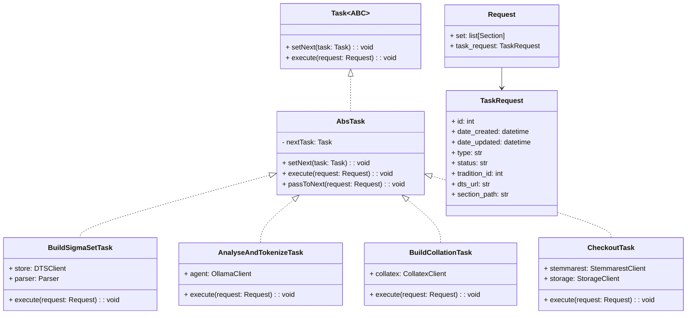

#### Pipeline Builder classes (builder pattern)
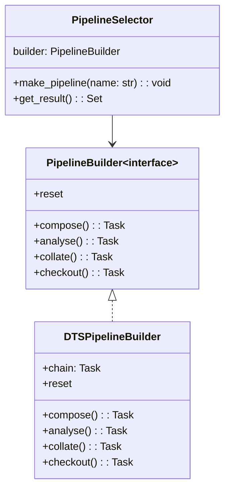

## AnalysisClient Specifications
The Analysis Client is a module that allows interaction with an AI agent server to perform NLP tasks such as tokenization, lemmatization, and POS tagging. It is designed to be used within the σ-Bridge application to process text versions retrieved from DTS collections.

Ideally the client should also rely on a local nlp processor in case that a remote server is not available.

Ideally the result should include a Docker image of the selected NLP server that can be deployed alongside the σ-Bridge API.

### Features
- Connect to a local server using a specified host and port.
- Send text data to the server for processing.
- Receive and parse the processed output from the server.
- Handle errors and exceptions during communication with the server.

### input/output specifications
- Input: raw text string to be analyzed. Can contain special characters or elements like html elements, punctuation, and whitespace.

example: 

```python 
Hello, world! <hi />This is a test.
```

- Output: a dictionary containing the analyzed data, including tokens, lemmas, and POS tags. Punctuation and special elements should be preserved in the output but not tokenized. Punctuation are merged with the preceding token original value in the 'original' field.

example:

```JSON
{
    "tokens": [
        {"t": "Hello", "n": "hello+INTJ", "original": "hello,", "lem": "hello", "pos": "INTJ"},
        {"t": "world", "n": "world+NOUN", "original": "world !", "lem": "world", "pos": "NOUN"},
        {"t": "<hi />", "n": "", "lem": "<hi />", "pos": "SYM"},
        {"t": "This", "n": "this+PRON", "original": "this"},
        {"t": "is", "n": "is+VERB", "lem": "be", "pos": "VERB"},
        {"t": "a", "n": "a+DET", "lem": "a", "pos": "DET"},
        {"t": "test", "n": "test+NOUN", "lem": "test", "pos": "NOUN"},
        {"t": ".", "n": "", "lem": ".", "pos": "PUNCT"}
    ]
}
```

### constraints
- input text language should primarily be Ancient Greek, but the client should be flexible enough to handle other languages if needed.

### Class Diagram
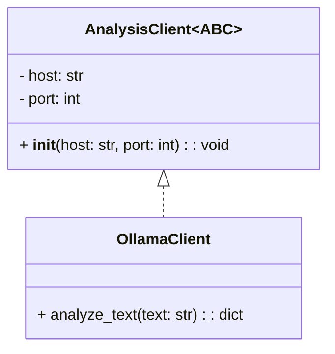

### entities interaction
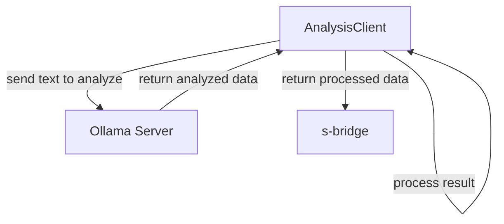

### Resources:

Original processing can be found in the old xml2stemmarest repo [here](https://github.com/unilenlac/xml2stemmarest/blob/main/shell-scripts/xml2stemmarest.sh)

### suggested dependencies
- cltk
- spacy
